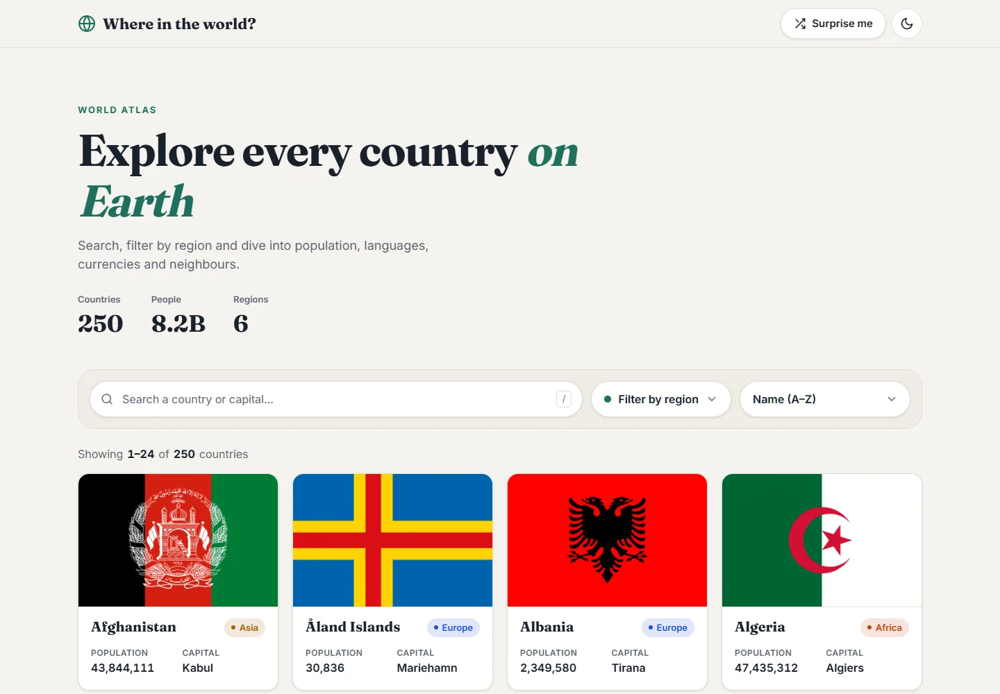
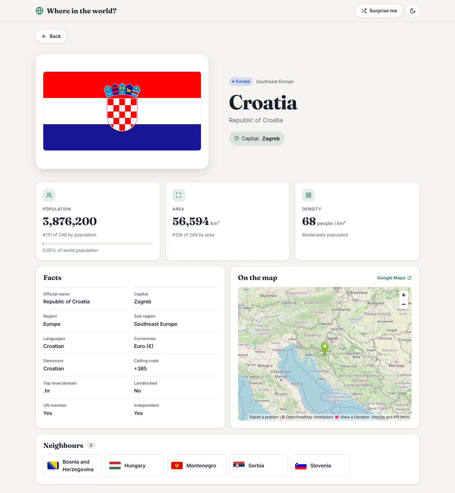
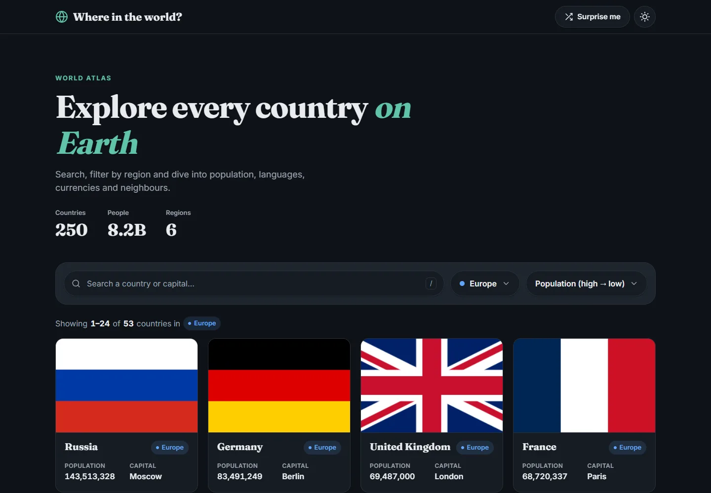
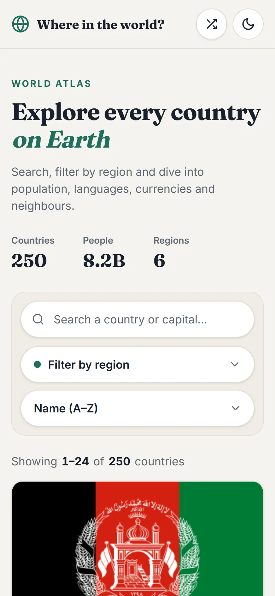
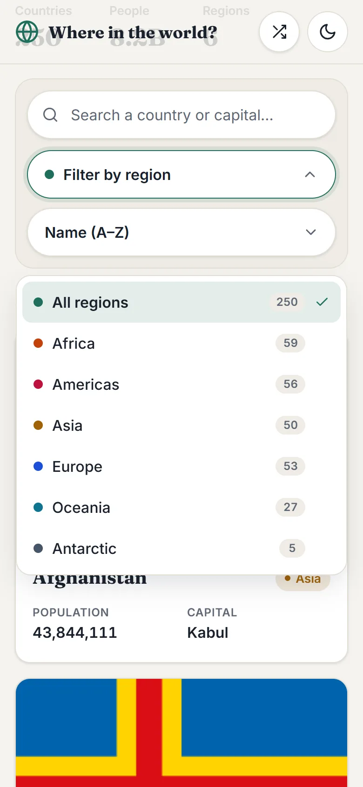
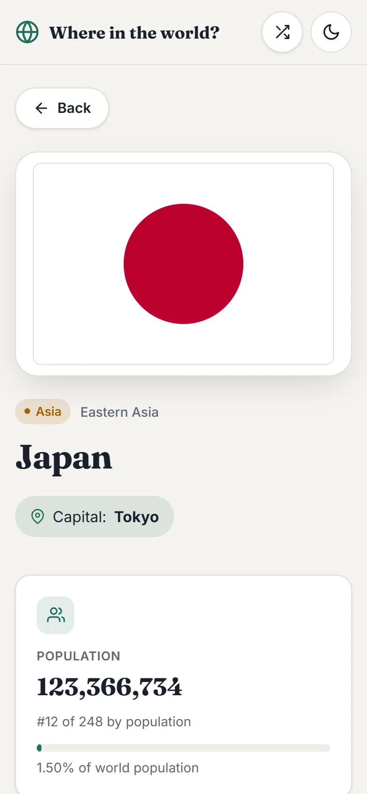

# Where in the world? 🌍

A React app for exploring every country in the world. You can search, filter by region and sort countries, and each one has its own page with key numbers, facts, a map and its neighbours.

**[Live demo](https://react-js-country-app-git-main-nikolas-projects-d50df3a6.vercel.app/)** · **[Portfolio](https://nikolazovkoportfolio.netlify.app/#home)**

## Features

- **Search** by country name, official name or capital. Accents don't matter, so `aland` finds _Åland Islands_. Press <kbd>/</kbd> to jump to the search box.
- **Filter by region** from a dropdown that shows how many countries each region has. It closes when you click outside it or press <kbd>Esc</kbd>.
- **Sort** by name, population or area.
- **Shareable URLs**: search, region, sort and page are kept in the URL, so they are still there when you come back from a country page.
- **Country page** with:
  - population, area and density, with numbers that count up and the country's world ranking
  - a bar showing the country's share of the world population
  - facts: capital, languages, currencies, calling code, domain, demonym and more
  - an OpenStreetMap map with a link to Google Maps
  - clickable neighbours, so you can travel from country to country
- **Surprise me** button that opens a random country.
- **Light and dark theme**. Light is the default, and the choice is remembered.
- **Responsive** from small phones (320px) to large screens.
- **Animations**: cards fade in one after another, skeleton cards show while loading, and there are hover effects. All of it respects the system's _reduce motion_ setting.

## Screenshots

| Country page                                           | Dark theme                                     |
| ------------------------------------------------------ | ---------------------------------------------- |
|  |  |

| Mobile                                            | Region filter                                         | Country on mobile                                            |
| ------------------------------------------------- | ----------------------------------------------------- | ------------------------------------------------------------ |
|  |  |  |

## Tech stack

- [React 18](https://react.dev/) + [Vite](https://vitejs.dev/)
- [React Router 6](https://reactrouter.com/) for routing and URL state
- [React Icons](https://react-icons.github.io/react-icons/) (Feather icons)
- Plain CSS with custom properties for theming
- Deployed on [Vercel](https://vercel.com/)

## Data

The app used to call the REST Countries API v3.1, which has been shut down. The data now lives in a static file, [`public/countries.json`](public/countries.json), built by [`scripts/build-countries.mjs`](scripts/build-countries.mjs) from:

- [mledoze/countries](https://github.com/mledoze/countries): names, capitals, languages, currencies, borders and coordinates
- [World Bank](https://data.worldbank.org/indicator/SP.POP.TOTL): population
- [Wikidata](https://www.wikidata.org/): population for territories the World Bank doesn't cover
- [flagcdn.com](https://flagcdn.com/): flag images

Run `npm run build:data` to refresh the numbers, then commit the updated JSON.

## Author

**Nikola Zovko**, Stockholm, Sweden

[Portfolio](https://nikolazovkoportfolio.netlify.app/#home) · [GitHub](https://github.com/Nikolaz95) · [LinkedIn](https://www.linkedin.com/in/nikola-zovko-a50779247/) · [Email](mailto:nikolajoe95@gmail.com)
